# From Superficial to Deep Language Bias driven Curriculum Learning for Visual question Answering

### Abstract

Most Visual Question Answering (VQA) models are faced with language bias when learning to answer a given question, thereby failing to understand multimodal knowledge simultaneously. Based on the fact that VQA samples with different levels of language bias contribute differently for answer prediction, in this paper, we overcome the language prior problem by proposing a novel Language Bias driven Curriculum Learning (LBCL) approach, which employs an easy-to-hard learning strategy with a novel diffculty metric Visual Sensitive Coeffcient (VSC). Specifically, in the initial training stage, the VQA model mainly learns the superficial textual correlations between questions and answers (easy concept) from more-biased examples, and then progressively focuses on learning the multimodal reasoning (hard concept) from less-biased examples in the following stages. The curriculum selection of examples on different stages is according to our proposed diffculty metric VSC, which is to evaluate the diffculty driven by the language bias of each VQA sample. Furthermore, to avoid the catastrophic forgetting of the learned concept during the multi-stage learning procedure, we propose to integrate knowledge distillation into the curriculum learning framework. Extensive experiments show that our LBCL can be generally applied to common VQA baseline models, and achieves remarkably better performance on the VQA-CP v1 and v2 datasets, with an overall 20% accuracy boost over baseline models.

### 1.introduction

在本文中，作者探索了课程学习（CL）的思想，用于无偏见的VQA模型，并提出了一种新的语言偏见驱动的课程学习（LBCL）方法。CL旨在通过机器学习模型的训练体现人类的认知过程。它的核心思想是，首先用简单的例子进行训练，然后根据预先定义的训练标准，逐步关注难的例子。在LBCL中，一方面，简单概念指的是问题和答案之间的表面文本关联，这可以很容易地从更有偏见的训练实例中捕捉到（例如，用“黄色”回答“香蕉的颜色”）。尽管这些伪相关性在多模态信息的联合推理中起到了负面作用，但它们仍然包含一些用于答案预测的基本元素（例如问题类型的问题意图和相关答案候选），这将有利于VQA模型在其初始学习阶段缩小答案空间。另一方面，困难的概念是充分利用视觉和文本模式的深度多模态推理。作者声明，硬概念主要是通过训练偏小的示例（例如“绿色香蕉”）获得的，因为它们不能以基于文本相关性的较低错误来规范训练过程，并且需要更多的视觉依赖性来回答问题。

LBCL的概念图如图1所示。以与“什么运动”问题类型相关的VQA实例为例。如关于答案分配的黄色方框所示，“网球”是给定问题的最优先答案，而一些答案（如“飞盘”和“冲浪”）的比例在列车分割中不够。在LBCL的第一阶段，在原始训练数据上训练VQA模型。这被认为是一个容易学习的阶段，因为训练是由先前的地面真相答案主导的，而VQA模型倾向于更多地了解问题和主要答案之间的文本相关性（“什么运动”的问题可能也可以用“网球”或“棒球”来回答）。同时，在第一阶段预测的基础上，可以基于一种新的视觉敏感系数（VSC）来定义课程学习的难度度量，该系数用于评估VQA样本在严重语言偏见下从视觉模态中获得的益处。在接下来的阶段中，通过课程选择功能来选择具有所需难度的示例，从而实现从简单到困难的过渡。随着训练阶段的进行，更多表面示例的学习梯度将被排除在外，VQA模型转而专注于较少表面的示例（“滑雪”和“足球”）。此外，作者建议将知识蒸馏与课程学习相结合，以实现无偏见的VQA，从而通过容易到难的学习来缓解灾难性遗忘问题。

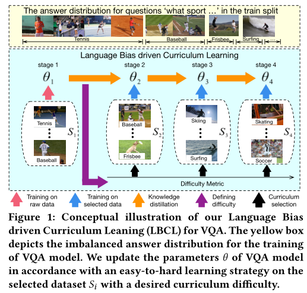

这是首次尝试引入课程学习来克服VQA任务中的语言偏见。作者的LBCL模块是通用的和模型无关的，可以应用于各种VQA模型。在本文中，作者证明了LBCL在最近三个表现最佳的基线模型（即UpDn、BAN和MCAN）上缓解语言先验的能力。为了证明LBCL方法的通用性和有效性，对VQA-CP v2和v1数据集进行了广泛的消融研究，这些数据集专门用于评估VQA模型在严重语言先验下的鲁棒性。实验结果表明，作者的方法以20%的显著增益超过了基线模型，并且在附录中描述的VQA-CP v1和v2的小规模训练数据集上获得了优异的性能。最后，作者将LBCL与最先进的去噪策略进行了比较，在VQA-CP v2（60.74%）和v1（61.57%）数据集上实现了显著更好的性能。

### 2.相关工作 略

### 3.语言偏见驱动的课程学习

概述框架：LBCL旨在用一种简单易行的策略来训练VQA模型，以克服语言偏见问题。LBCL架构的概述如图2（a）所示，采用了与“天空是什么颜色”相关的VQA培训实例作为一个例子来分析方法。从图2（a）所示的饼图来看，上述问题的基本真相答案以“蓝色”为主，而“红色”和“黄色”是罕见的标签。在第一个学习阶段，在原始偏差数据集上训练带有额外的仅问题模型的VQA模型。在此期间，由于训练答案分布不平衡，VQA模型容易学习更容易的VQA概念（“蓝色”通常用于描述天空的颜色）。此外，利用该阶段的预测作为先验知识，并进一步将难度度量视觉敏感系数（VSC）定义为下一个多阶段易到难训练阶段的训练标准（图2（b）中的紫色框））。

以下训练阶段（从2到n）保持基于第一阶段中定义的难度度量VSC的训练标准序列。通过课程选择功能（图2（c）中的红色框）实现从容易到难的转换，该功能以所需的难度动态调整训练实例的损失权重。随着训练的进行，来自更多偏见实例（“蓝色”和“黑色”天空）的反向传播梯度将被移除，VQA模型将通过逐渐关注偏见较少的实例（“红色”和“黄色”天空）来学习“硬”概念。此外，为了通过多阶段学习避免灾难性遗忘问题，利用知识蒸馏（图中的绿色方框）将知识从前一学习阶段转移到下一阶段。

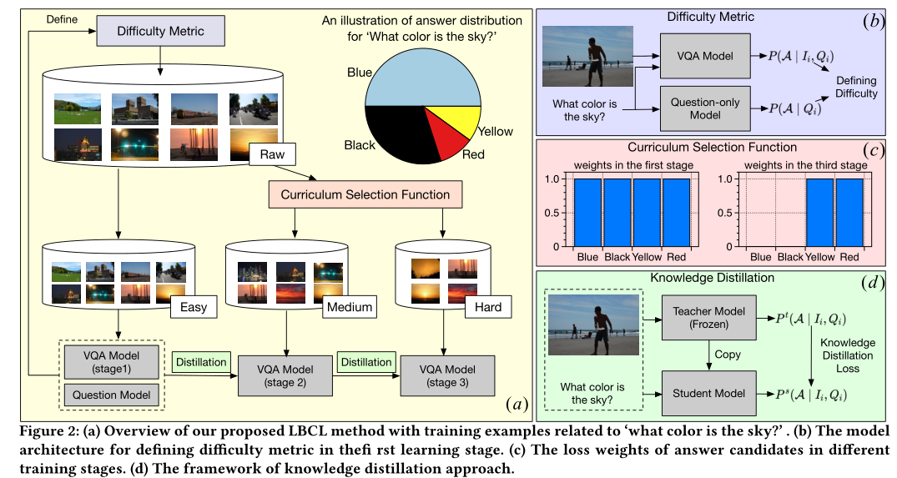

#### 3.1 困难度量

难度度量是课程学习不可或缺的组成部分，它作为一个评估指标，代表了VQA示例的特定任务难度。对于克服VQA任务中的语言偏见的课程学习，作者首先引入了一种基于训练误差（TE）的直观难度度量，并进一步提出了一种新的度量视觉敏感系数（VSC），以评估VQA训练实例在语言先验下的问题回答的视觉依赖性。
训练错误（TE）：基于TE的困难源于这样一种直觉，即更多有偏见的示例往往具有更少的训练错误，因为它们仅根据语言先验就可以轻松实现更高的性能。相反，偏差较小的样本在不平衡的VQA数据集中很少见，并且通常对VQA模型训练不足。因此提出了一种困难度量的方法TE，而对于第i个训练实例的第j个候选答案aij的TEij可以表示为：

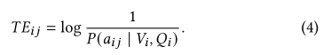

然而，TE度量不能反映和测量每个VQA训练样本的偏差水平和视觉依赖性。

视觉敏感系数（VSC）：为了从语言偏见的角度更好地评估示例的难度，为LBCL方法提出了一种新的难度度量视觉敏感系数。在严重语言偏见下的VQA任务中，简单的概念是问题和答案之间的文本相关性，而困难的是用于预测答案的视觉推理。因此，引入VSC来评估预测答案的VQA模型在强语言偏见下对视觉模态的依赖程度。特别地，基于成对互信息（pmi）定义了难度度量VSC，该互信息测量两个离散随机变量之间的相互依赖性。变量x和y的相互信息如下：

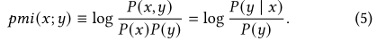

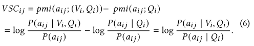

如果aij是第i个样例的GT，那么VSCij的值越大表示这个回答越依赖于视觉模态，反之VSCij<0，则表明越依赖于文本模态。

讨论：LBCL中定义难度度量的框架如图2（b）所示。除了VQA模型（等式1）之外，类似于其他去重策略，作者还使用了一个问题模型。它是一个单分支网络，仅基于问题特征来获得有偏差的预测：

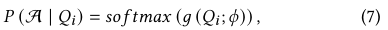

#### 3.2 课程选择函数

课程选择功能是确定在当前阶段应使用哪些示例进行培训。在LBCL中，采用加权方法，根据第一阶段定义的难度度量（VSC或TE）动态选择训练示例。

选择功能的核心是确定实时模型能力（当前阶段的难度阈值）和总训练阶段的数量。给定预定义的最大模型能力Cmax（最终训练阶段的期望难度阈值）、难度增量参数γ和初始难度值d2（首先在LBCL的第二阶段中使用），第t训练阶段和总训练阶段中的实时模型能力C（t）被格式化为：

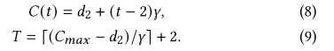

然后，通过为第t个学习阶段的交叉熵损失分配第i个示例的二进制权重wi（t）来动态选择训练示例：

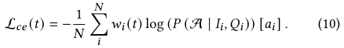

Wi(t)决定与VSC和当前模型的能力C：

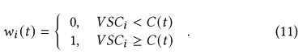

对于多标签分类VQA任务，二进制权重wij（t）被分配给第i个示例的第j个候选答案：

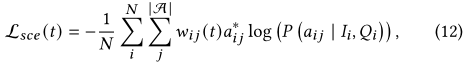

图2c表示了说明了损失函数从容易阶段到困难阶段的变化，第一阶段的损失权重平均分布在每个候选答案上，而在接下来的阶段中，更多偏见示例（“蓝色”和“黑色”）的答案权重为零，从而使VQA模型受益于关注硬示例（“红色”和“黄色”）。

#### 3.3 知识蒸馏

LBCL方法是一种由易到难的多阶段学习策略。在逐步训练过程中，VQA模型不可避免地会遗忘之前的知识。针对这一问题，作者提出将知识蒸馏法与课程学习相结合的方法来克服遗忘问题。

知识蒸馏框架为师生网络结构，如图2(d)所示。具体地说，教师模型是上一阶段预先训练的冻结结构。在当前阶段的训练之前，学生模型复制自教师模型，其参数和网络结构与教师相同。然后，基于相应阶段的课程选择函数，用加权VQA实例训练学生模型。同时也将相同的训练数据输入到分离的教师模型中，并进一步利用其预测结果作为学生模型的监督。实际上，采用常见的Kullback-Leibler散度约束作为蒸馏损失。其提法定义为:

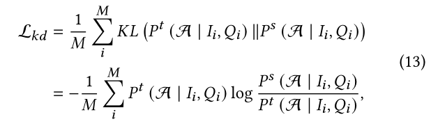

Lkd表示与教师模型预测的pt与学生模型预测的ps的KL距离。M表示这一批次的数据量。所以总损失在第t时刻的总损失Lall(t)为（t>=2）：

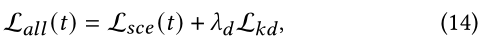

其中lamda d是一个权重，用于调整VQA损失和知识蒸馏损失之间损失项的贡献。

算法管道:基于上述LBCL中的关键组件，作者的方法如何工作的详细描述在算法1中总结。通过使用最终训练的模型，测试阶段只执行一次。值得注意的是，LBCL是模型无关的，可以应用于任何一类基于分类的VQA模型，以减轻语言偏差。

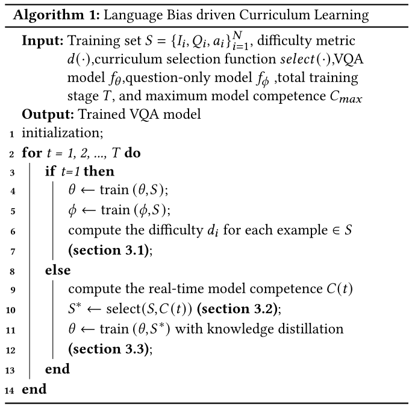

### 4.实验
#### 4.1 数据集与Baseline
数据集:在本文中，作者在VQA-CP v1和v2数据集上训练和评估LBCL方法。基线:为了证明LBCL是模型无关的，在三个VQA模型上测试它:UpDn，BAN和MCAN。
#### 4.2 实现细节 略
#### 4.3 消融实验
课程学习vs非课程学习:如表1所示，结合LBCL和VQA模型可以显著提高“整体”性能。

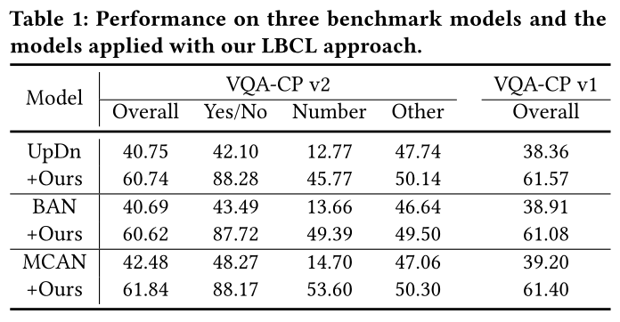

VSC vs TE:比较了两阶段LBCL下提出的难度指标训练误差(TE)和视觉敏感系数(VSC),如表2所示。

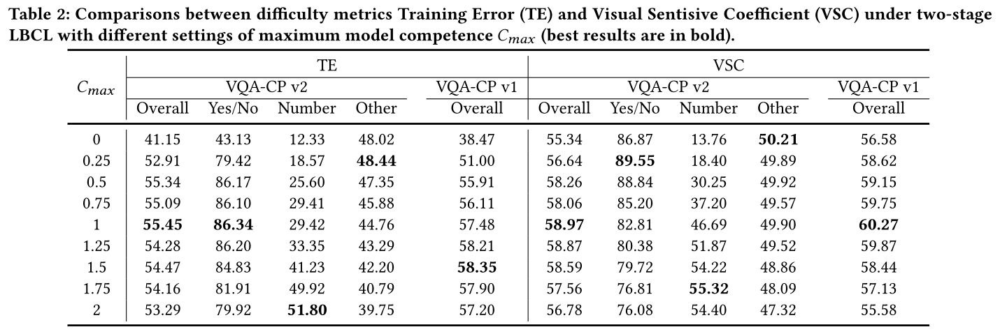

简单概念的重要性。作者还展示了两阶段LBCL中简单概念(文本相关性)的重要性(与“TE vs VSC”中的结果相同)，如表3所示。

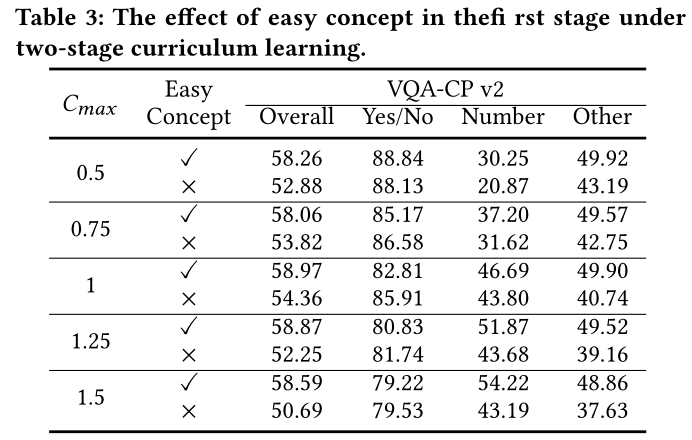

难度增加参数的变化:图3(a)描述了LBCL与不同难度增加参数W设置的比较，这意味着模型能力C(t)从第t阶段到第t+1阶段的增量。

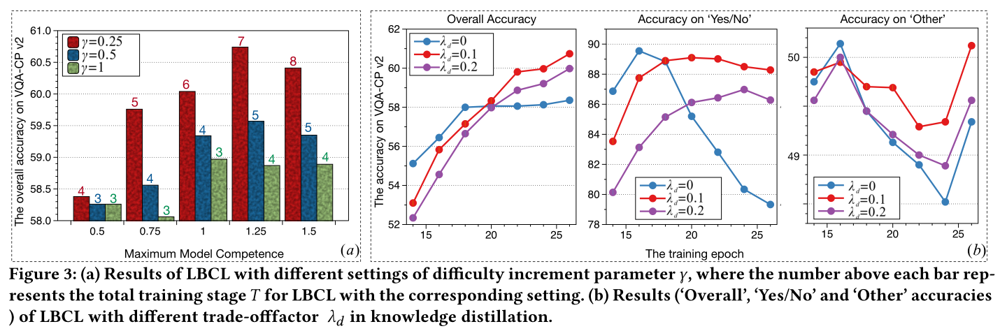

知识蒸馏的贡献:图3(b)显示了LBCL方法中知识蒸馏的优势，所有实验都在LBCL下进行，Cmax = 1.25, W = 0.25(图3(a)中的最佳结果)。

#### 4.4 与SOTA的比较

在VQACPv2和v1数据集上的准确率如表4表5所示。

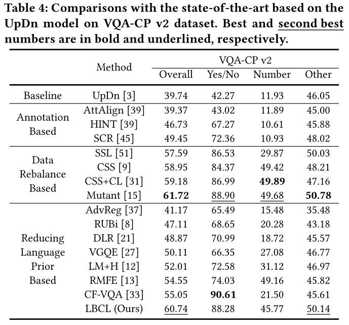

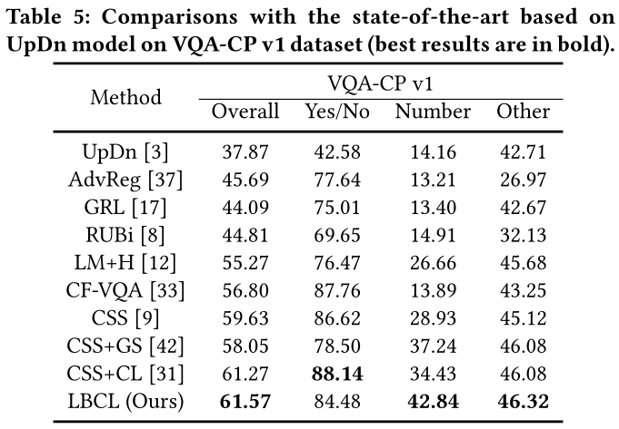

图4显示了VQA样本在“有多少”和“什么运动”这两个问题类型上的VSC(难度度量)不同的定性结果。

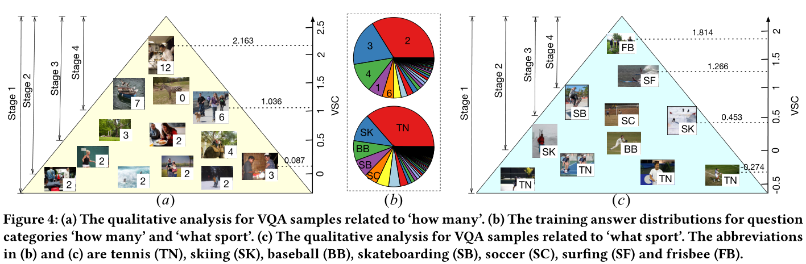

### 5.结论
作者提出了一种新的基于语言偏差驱动的课程学习模型(LBCL)，使VQA模型通过易难的训练策略克服语言先验。在LBCL结构中，作者设计了一个新的视觉灵敏度度量(VSC)来根据语言先验评估每个VQA实例的视觉灵敏度。最终还将知识蒸馏融入LBCL中，通过渐进训练避免灾难性遗忘问题。大量的实验证明了该方法的有效性。
