# ChartQA: A Benchmark for Question Answering about Charts with Visual and Logical Reasoning

## Abstract

Charts are very popular for analyzing data. When exploring charts, people often ask a variety of complex reasoning questions that involve several logical and arithmetic operations. They also commonly refer to visual features of a chart in their questions. However, most existing datasets do not focus on such complex reasoning questions as their questions are template-based and answers come from a fifixed-vocabulary. In this work, we present a large-scale benchmark covering 9.6K human-written questions as well as 23.1K questions generated from human-written chart summaries. To address the unique challenges in our benchmark involving visual and logical reasoning over charts, we present two transformer-based models that combine visual features and the data table of the chart in a unified way to answer questions. While our models achieve the state-of-the-art results on the previous datasets as well as on our benchmark, the evaluation also reveals several challenges in answering complex reasoning questions.

*   **背景：**图表问答会涉及到**复杂的推理问题**，包含很多逻辑和数学操作；提问的时候往往会在问题中提到**图表中的视觉特征**。

*   **现状：**而大部分现存数据集没有聚焦这样复杂的推理问题，且大部分问题的答案都来自于固定词库。

*   **本文工作1：**本文提出了一个**大型的基准数据集**，包含了9600个人类提出的问题和23100个从人类写的图表总结中生成的问题。

*   **本文工作2：**提出了两个**基于transforme**r的模型，结合了**视觉特征**和从图表中抽取出来的**表格结构**来以一种统一的方式来回答问题。

*   **模型效果：**本文模型在之前的一些数据集上都达到了sota的效果，在本文数据集上也达到 了sota的效果，评价结果也表明在回答复杂推理问题方面仍然存在一些挑战。

## 1.Introduction

**研究背景：**图表应用广泛，分析数据的时候会针对图表提出一些复杂的推理问题，涉及到算术和逻辑操作。回答这些问题需要大量的感知和认知方面的努力，因为需要将多个操作结合起来才能得到答案，例如检索数值、比较值，找到最大值、计算和差等操作。**例如**图1中的问题Q1需要用户计算两条线之间的每年的差值，并找到差值最大的一年。

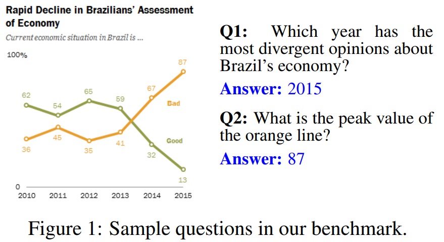

**研究内容：** **图表问答任务**就是以**一张图表**和**一个自然语言问题**作为输入，预测出问题的答案。

图表问答任务跟其他QA任务（文本QA和表格QA）不一样，图表问答的输入是一个数据的视觉表示形式，这样的形式可以让读者的注意力都被数据一些突出的特征吸引，例如趋势和异常值。除此之外人们问问题的时候还喜欢通过引用视觉符号的一些特性来提问，**例如**图1中Q2引用了线的颜色来提问图表中这条线的最高点。

**现存图表问答数据集的不足之处：**

​	1.问题是用预定义好的模板生成的，缺乏自然语言的特性。

​	2.图表是用程序工具（例如Matplotlib）自动生成的，缺乏来自真实世界的表格的风格多样性。

​	3.大多数数据集的**答案来自一个小的固定的词库**（例如图表轴标签、yes、no这些），忽略了很多复杂的推理问题，推理问题的答案是通过各种各样的数学操作（例如求和、比较）得到的。

**现存图表问答方法的局限性：**

​	**方法1：**因为大部分数据集只有答案是在固定词库上的问题，现存模型通常把这样的问题作为一个**分类问题**来处理，并且依赖于对问题和答案的动态编码技术，问题和答案中的词被编码成图表元素的空间位置的形式（例如x轴标签1）。这样的方法在**OCR模型结果错误**的时候或者**用图表元素名称的同义词提问**（例如US和United States）的时候就不管用了。

​	**方法2：**PlotQA尝试用**表格问答模型**来回答开放词库的问题，但是他在回答视觉推理问题时没有考虑任何图表的**视觉特征**。

**本文提出了一个大型benchmark数据集。**

包含9608个人工提问的问题（主要是**逻辑和视觉推理**的问题），用T5模型从人类写的图表总结中自动生成了另外23111个问题（手工验证了部分问题以确保问题质量），用这样的方式自动得到了**大量**问题，且这些问题**语言变化性都很丰富**，因为是用人写的图表总结生成的问题。

包含20882张图表图片，是从4个不同的网站上收集到的，以确保图表**风格和话题的多样性**。

**本文提出了一个将图表的表格结构和视觉特征结合起来的方法。**

1.先用改进后的ChartOCR模型抽取出图表的基本数据表格。

2.同时用神经网络模型抽取出图表图片的视觉特征。

3.改进了两个基于transformer的QA模型，同时利用了图表的表格结构和视觉特征，来预测出答案。

*   主要是针对本文数据集的挑战提出的，由于很多问题都涉及到了很**复杂的推理**和图表的**视觉特征引用**。

*   本文提出的模型在之前的数据集和本文提出的数据集上达到了sota的效果，或是跟之前的方法达到了同样的水平。

**本文贡献：**

1.提出了一个大型图表问答数据集，有真实世界的图表和人工标注的问答对；

2.一个框架方法，通过结合图表的表格结构和视觉特征，用到基于transformer的QA模型中去，最终达到了sota的效果。

3.对本文模型进行扩展分析及效果评估。

代码和数据集公布在[github]( https://github.com/vis-nlp/ChartQA "github")上。

## 2.Related Work

### 2.1现存数据集

ChartQA和之前的数据集存在两个方面的区别：①问题类型（人工提出的vs基于模板的）；②图表来源（源自真实世界vs用工具生成的）。数据集对比见表1。

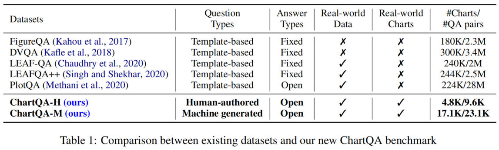

**早期数据集**

①FigureQA、②DVQA、③LEAF-QA、④LEAF-QA++

特点：

1.  问题都是用较少的模板生成出来的。

2.  问题的答案都来自一个较小的固定的词库（例如yes、no）。

3.  图表都是用同样的软件自动生成的。

**PlotQA**

是唯一一个有开放词库问题的数据集，这样的问题需要对基本图表数据进行聚合操作。

缺陷：

1.  没有视觉推理相关的问题。

2.  问题是用模板生成的。

3.  图表是用一个软件绘制的。

**Kim et al(2020)**

用一个**很小**的人工标注的数据集做了一个可解释性研究，这个数据集只有 52张图表和629个问答对用于理解人们怎么对图表进行提问并得出答案。

结论：目前没有包含了**人工标注的视觉和逻辑推理问题**且**图表图片来自真实世界**的大型的图表问答数据集，因此本文提出了ChartQA数据集。

### 2.2 现存模型

现在解决CQA问题主要有两种方法。

**第一种方法**是基于VQA模型的**分类方法**，这样只能处理固定词库的问题。

1.  用encoder对问题和图表图片进行编码。

2.  用注意力机制将问题和图表的特征结合在一起。

3.  将结合后的特征送到分类器里去做分类任务。

这些模型大部分都用到了**动态编码技术**，将问题编码成图表中文本元素的位置信息的形式，但是这样很容易受到OCR噪声的干扰。

**第二种方法**用了**表格问答**方法。

1.  要么就是假设图表的数据表格已经给出。

2.  要么就是从图表图片中用视觉技术抽取出表格结构来。

### 2.3 图表数据抽取

**早期图表数据抽取方法**

1.  提出过一种**半自动系统**来从图表图片中抽取出数据。

2.  提出过一种全自动的图表数据抽取流程。

这些方法都依靠不同的启发式方法，这放在很多真实世界的图表上没啥用且效果有限。

**Luo et al. (2021)**

提出了一种图表数据抽取方法从真实世界的图表中以较高的准确率抽取了数据，但是这个模型还是只预测了图表中符号元素的**原始数据值**，没有将这些值跟对应的轴或者图例关联起来形成表格数据。

本文扩展了ChartOCR的模型抽取了**完整的表格结构的数据**将其送到本文模型中去。

## 3.ChartQA Datasets

### 3.1 数据收集和准备工作

图表来源：4个网站（为确保数据集的图表**风格**和**话题**多样性）

1.  **Statista：**话题包括经济、政治、工业等。

2.  **The Pew research：**涵盖了很多关于社会和经济事件、人口趋势统计、公共选择的报告，这些报告里囊括了各种各样的图表。

3.  **Our World In Data（OWID）**：关于各种全球事务例如经济、金融、社会的图表。

4.  **Organisation for Economic Co-operation and Development（OECD）：**关于政策制定的报告和数据分析。

*   对于Pew网站，只爬取了**图表图片**，因为其没有对应的数据表格。

*   其他三个网站抽取了

    ①基本数据表格

    ②元数据（例如标题、图表类型）

    ③SVG文件以

    ④相关的文本描述

    最后从SVG文件中抽取出不同图表元素的标注框信息（例如x轴标签），用于训练数据表格抽取模型（ChartOCR）。

### 3.2 数据标注

**两个标注步骤：**

①找人为图表提问并给出答案，用Amazon Mechanical Turk（AMT）；

②用从statista上抽取出来的**人写的总结**中生成问答对。

#### 3.2.1 人工提问并标注答案

设计了AMT任务，找人对图表进行提问并给出答案。

主要关注两种类型的问题，复合问题和视觉问题。

**复合问题：**包含至少两种数学或逻辑的操作，例如求和、求差、求平均等。

**视觉问题：**需要在提问时通过图形元素的一些视觉特征（例如颜色、高度、长度等）来引用这些视觉元素（例如柱形）。

原因：主要关注这两种类型的问题是因为，①人们更倾向于这样去提问；②之前的数据集大都没有涉及到过这么复杂的视觉和逻辑推理问题。

标注细节：

1.  对每一个图表，标注员会提供两个带答案的问题。

2.  同样的问题之后会被另一个标注员回答一次。

3.  如果两个众包员的答案是一致的，我们就认为答案是正确的；否则我们会手工核对这个答案以得到最终的正确答案。

基于精准匹配的标注员之间的匹配率是61.04%。

问题：这样的精准匹配没有考虑到同一个词可能有不同的书写形式，或是数字的精确程度不同（例如3\$ vs 3 dollars，86.33 vs 86.3）。这些都是在人工标注是很容易出现的问题。

解决办法：因此在500个随机样本上手工调整了这些问题，然后发现考虑了不同的书写形式和数字精度之后发现准确率更高了，达到了78.55%。

#### 3.2.2 数据集增强

**之前的QA（例如visua QA、textual QA）的数据增强**，主要有2种方式：

1.  通过基于模板的方法。
    基于模板的问题通常缺乏语言上的变化性。

2.  通过机器生成问题。
    大型语言模型（例如T5），在大量来自不同网站的数据训练过，能学到一般的语言特性和变化。因此本文选择用T5来做数据增强。

**本文数据增强**

本文微调了一个在SQuAD QA数据集上预训练过的T5模型。用了从Statista上表格带的人类写的图表总结来自动生成问题，生成出来的问题在词汇和句法的变化性方面都足够了，很像人类提出的问题。

这个过程包括训练和应用了2个T5模型：一个用于答案抽取，另一个用于根据答案生成问题。

1.  **答案抽取**，给定summary作为输入，T5模型被训练来生成可能的由 \[SEP] token分隔开的答案（即在SQuAD的文章上训练——>答案对）。

2.  **问题生成**，上一步得到的答案会先跟summary连接起来，变成这种形式：Answer：Answer Context：ChartSummary。T5模型就会被训练去用图表summary来生成一个来自给定问题的问题。模型在SQuAD的（文章，答案）——>问题对上训练。

优点：因为这些总结都是人写的，所以生成出来的问题都跟人类写的问题很像。

缺点：T5的问题生成模型可能还是会生成一些不对的问题，因为训练集和测试集领域的不匹配。

1.  问题不完整。

2.  问题根据图表根本就回答不了（例如，“哪个省包括了Cape镇”这就是一个不可回答的问题，因为他需要图表以外的知识）。

解决办法：为了过滤掉这样的非法问题，本文设计了一个简单的启发式方法，如果答案不能在图表的数据表格中找到就把这个问题过滤掉。这个启发式方法主要是基于大部分生成问题的答案都是图表元素的值或者标签。

用了这个启发式方法后，我们手工分析了1250个问答对，并发现这些问题中86.64%都是完整且可回答的，并且对于给定的图表是正确的。

此外，为了评价的公平性，我们手动清理了机器生成数据集的测试集，移除了非法的问题。

#### 3.2.3 数据划分

随机将人类写的和机器生成的问答对划分为了训练、验证和测试集，划分方式见表2。

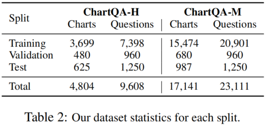

### 3.3 数据集分析

**图表类型**

数据集有三种广泛使用的图表类型：柱形图、折线图和饼图（见表3）。

**柱形图**是在所有数据集中最常见的图表，因为柱形图是在真实世界中用得很广泛。

进一步将柱形图、折线图和饼图分为了**简单版**和复杂版。

划分的依据：简单版的数据表格只有两列，复杂版的数据图表有很多列（例如堆叠柱形图、成组柱形图、多条线的折线图）。

柱形图：79.4%是简单柱形图，29.6%是复杂柱形图。

折线图：61%是简单折线图，39%是复杂折线图。

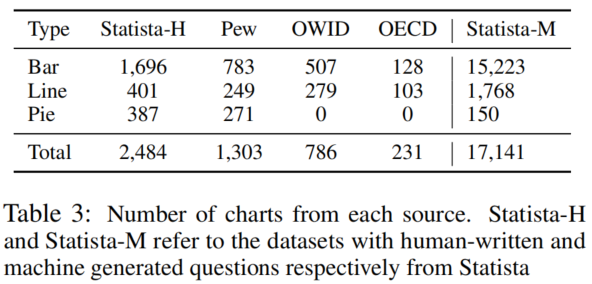

**基本语言学数据**

*   有**更多独有的词**

    在问答对类型和问题和答案中

    ChartQA-H中问题和答案中独有词分别有6150个和4319个。

    ChartQA-M的问题和答案中独有词分别有12379和11979个。

*   句法结构多样

    问题覆盖到了更多样的句法结构，有时会用到一些**非正式的表达**和**同义替换**。

    总的来说，这说明本文数据集**语言变化丰富**，可能给图表问答任务带来更大的挑战。

*   话题分布多样

    因为是从四个不同的来源收集的。政治是所有来源中最常见的一个话题，但在Pew数据集中几乎一半的图标都是关于美国的政治政策的（45.4%）。其他的常见话题包括经济、健康和社会等等。

**问题性质**

为了分析问题的性质，随机选择300个问答对并将它们分成了4种类型（见表4）。

*   大部分的问题（共占76.33%）要么是**组合型问题**，要么是视觉和组合型问题，这反映了真实世界的缩影，人们经常会问这些复杂的推理问题。

*   人们会用到视觉引用，引用图表图形的各种特征来代称该图形，大部分主要是颜色（例如橙色的线）和长度（例如最高的柱形）以及大小（例如最大的扇形）和位置（例如最左边的柱形）。

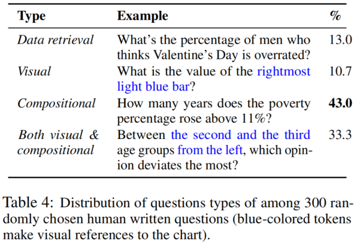

## 4.Method

### 4.1 问题公式化及数据抽取

**ChartQA模型流程**如图2所示。

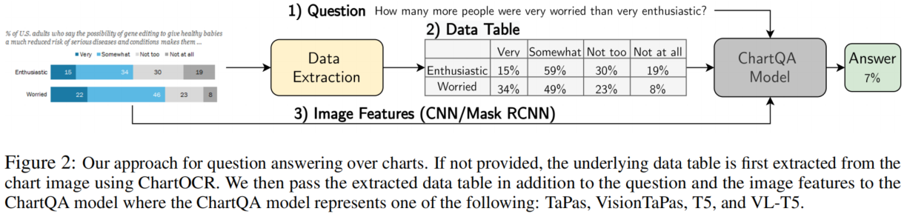

**图表问答任务公式化：**

给定一个由N个样例的数据集 $\mathcal{D}=\{c_i,t_i,q_i,a_i\}^{N}_{i=1}$。

​	$c_i$代表一张图表图片

​	$t_i$代表数据表格

​	$q_i$代表针对图表$c_i$提出的问题

​	$a_i$代表问题的答案。

图表问答模型就是给定 $ c_i，t_i和q_i $，需要预测出答案 $a_i$。

**ChartQA的2个问题设置：**

**问题设置1：**图表自带对应的可用的基本数据表格。

**问题设置2：**图表没有对应的可用的基本数据表格，图表$c_i$的基本数据表格$t_i$用ChartOCR的改进版抽取得到。

**ChartOCR**

1.  定位：先对图表图片中的主要元素（例如图表区域、标题等）和需要被编码成数据的图形记号（例如柱形）进行定位。用的是关**键点检测网络**。

2.  确定图形记号代表的值：用检测得到的每种图形的关键点跟轴坐标联系起来去估计图形记号对应的数值。

缺陷：不会将预测的数值跟对应的文本标签（例如x轴标签）对应起来。

改进：本文对ChartOCR进行了扩展，使其能够**输出完整的数据表格**。利用CRAFT模型（OCR）识别出图表元素中的文本。然后把数值跟其文本标签用**位置**和**颜色**信息关联起来。

### 4.2 模型

本文在ChartQA上用的方法主要是基于两个**表格问答上的sota模型**：**T5和TAPAS**。

模型的输入：问题$ q_i$和数据表格$t_i$。

跟表格问答不同的是，图表问答通常会涉及到图表图片的视觉信息的抽取。为了这部分内容，本文也用带有**视觉信息抽取模块**的图表问答模型进行了实验，把图表图片特征也考虑了进去。T5有一个视觉版的变种——VL-T5，TAPAS没有视觉版本的变体。因此我们扩展了TAPAS使其将图片特征考虑进去，并为其命名为VisionTAPAS。更多细节详见。

#### 4.2.1 T5

T5是一个encoder-decoder模型，该模型用了同样的结构和损失函数将NLP任务统一为text-to-text的生成任务。这个模型已经在大量的未标记数据上用自监督降噪目标训练过。

微调T5放在我们的ChartQA任务上用，将数据表格展平，跟问题一起送到模型里，其形式为“Question：Question tokens；Table：Flattened table tokens”。模型训练后能够直接生成答案。

#### 4.2.2 VL-T5

VL-T5是一个T5的扩展版，将视觉语言任务统一成一个多模态输入的文本生成任务。输入包含了文本token和从图片中用Faster R-CNN抽取出来的对象的**视觉特征**。

这个模型是在多个多模态任务上训练的，例如语言建模，视觉问答以及视觉定位任务。

把VL-T5用于图表问答任务，主要进行了以下处理：

1.  对于文本输入，跟T5一样，将数据图表图片的数据表格进行展平操作，并将其跟问题文本连接在一起。

2.  对于视觉输入，用Mask R-CNN抽取了图表图片中不同符号（例如柱形、折线等）的视觉特征，Mask R-CNN用ResNet作为其backbone。
    不像原始的VL-T5，提供了固定 数量的目标（36个），在图标问答任务中各个图表的元素数量是不一样的。为了考虑这个因素，我们对抽取出来的视觉特征进行0填充，使得其长度固定为36。

#### 4.2.3 TAPAS

TAPAS扩展了BERT结构，对表格的行和列加了一个位置编码来对表格进行编码。

**模型输入：**

如图3.a所示，模型输入格式如下所示：**\[CLS] - 问题tokens - \[SEP] - 展平后的表格tokens**。这些token是用针对表格的位置嵌入加上BERT部分和位置嵌入编码得到的。

**模型输出：**

有两个输出头：aggregation operator头和cell selection头。

aggregation operator头会预测一个会施加在cell selection头选出来的单元格中的值上的操作（例如计数、求和、求平均、或者啥都不做）。根据这个操作类型，被单元格选择头选出来的单元格就能计算出最后的答案或者一个用于预测出最后答案的输入。

**预训练：**TAPAS先用表格文本对在掩**码语言建模目标**上预训练的。这些表格文本对是从维基百科上爬取的，表格的单元格会被随机蒙住，这个模型就被训练来预测这些单元格。

**微调：**用弱监督方式（用答案作为唯一的监督）以端到端可微目标进行微调。

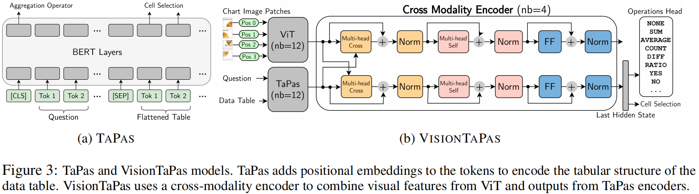

#### 4.2.4 VisionTAPAS

VisionTaPas是我们在图表问答任务上对TaPas的一个扩展版本。模型结构如图3.b。

它包含了三个主要部分：

①一个Vision Transformer encoder用于编码图表图片；

②一个TaPas encoder用于编码问题和数据表格；

③一个交叉模态encoder。

**Vision Transformer（ViT）**

ViT把transformer的encoder结构用在了视觉任务上。

①给定一张2维的图表图片，这张图片会被划分成一个2维的块的序列 $\{p_1,...,p_n\}$。

②每个块然后会展平并线性投射成一个d维的嵌入向量。

③把1维的可学习位置编码加到图片特征中去，用于加入这个块的位置信息。

一个L层的ViT encoder会输出一个嵌入序列 $H=\{h_{cls}^L,h_1^L,...,h_n^L\}$代表特殊的 \[CLS] token和图片块。

我们用了Dosovitskiy et al. 2021中预训练的权重来初始化ViT这个模块。

**TaPas encoder **

TaPas encoder用了跟ViT一样的方式对**问题**和**数据表格**的token进行编码。

对于一个输入的词序列 $\{w_{cls},w_1...,w_m\}$，一个L层的TaPas会生成对应的编码结果 $Z=\{z_{cls}^L,z_1^L,...,z_m^L\}$。

这个模块是用Herzig et al. 2020这篇论文里TaPas在WikiTQ数据集上预训练后的权重初始化的。

**交叉模特编码器**

**输入：**ViT和TaPas encoder的输出（H和Z）。

**输出：**计算得到多模态编码。

有4个模块，每个模块都包含一个视觉分支和一个文本表格分支。

①两个分支的输入首先分别经过一个多头交叉注意力层，在视觉分支中，询问向量是视觉特征；在文本-表格分支中，key和上下文向量是文本图表特征。

②交叉注意力后得到的特征送到一个自注意力层里，后面是一个全连接层。类似transformer模型，每一层都用了层normalization，并且还有残差连接。

③最后把TaPas的aggregation operation头和cell selection头加到文本-表格分支的最后一层去了。

**扩展其他操作**

1.  ChartQA数据集中的许多问题需要进行减法或者求比率的操作，这些都是原始的TaPas模型不支持的操作。因此我们扩展了operation头，加了这两种操作（见图3.b）

2.  相比把他们放在一个基于**最终答案**的弱监督学习方式上训练（就像TaPas上做的那样）我们发现对单元格提供更直接而非存在潜在噪声的监督会更有效。我们依靠一些启发式方法来生成我们训练数据的监督信号。例如，给定一个问题“A和B之间相差多少？”，答案是5，数据值是3，6，8，我们寻找两个差值是5的数（例如8和3），尽管这可能会产生一些噪声监督信号，但类似的方法已经成功用来给神经网络注入推理能力了。随机采样了100个这样的问题，人工核验结果显示我们的启发式方法会有24%的噪声。

3.  为了处理固定词库（yes或no）的问题，我们进一步扩展了操作头，把这些类包括进去了。

## 5.Evaluation

### 5.1 数据集，baseline和评价指标

在3个图表问答数据集上验评估了本文模型的效果，分别是FigureQA、PlotQA和DVQA。同时也在本文新提出的这个ChartQA数据集上验证了效果。

把4.2节中介绍的4个benchmarking模型（T5、VL-T5、TaPas、VisionTaPas）跟以下两个baseline进行对比：

*   **PREFIL**是一个分类方法，平行融合了问题和图片的特征，然后对这些特征进行聚合，聚合后送到最后的分类层里去。

*   **PlotQA\***是对PlotQA论文中方法的重新实现。

    ①对图表图片进行解析，抽取出基本数据表格。

    ②然后用了Pasupat and Liang (2015)提出的表格问答模型。

    缺陷：然而因为PlotQA的数据抽取方法是针对他们的生成数据集使用的，不能很好的泛化应用到真实世界的图表上。

    所以本文用了本文改进后的ChartOCR方法抽取出来的数据表格来评估PlotQA的效果。

**答案认定正确标准**

根据PlotQA中的做法，本文对数值类型的答案用了一个宽松的准确率评价，允许一点小小的在自动数据抽取过程中可能造成的误差。一个答案误差在5%范围内的时候我们认为它是正确的。对于非数值答案，我们还是需要一个准确匹配，我们才认为答案是正确的。

### 5.2 结果

#### 5.2.1 以前的数据集

**结论1：**

​	**提供数据表格的标注数据：**

​		VisionTaPas和VL-T5达到了接近完美的效果。

​	**没有提供数据表格的标注数据：**

​		本文模型效果稍有下降。

​	**结论：**但**VisionTaPas在DVQA上**和**VL-T5在PlotQA V1**上还是达到了sota结果（全自动设置）。

​	**数据支撑：**VisionTaPas在DVQA的测试集上达到了94.54%的准确率，比PReFIL高了14.5%。

**结论2：**

​	**控制变量-是否提供OCR文本标注信息**

​	**结论：**本文模型VisionTaPas面对OCR噪声的时候更加健壮。

​	**数据支撑：**对比PReFIL和VisionTaPas在DVQA的Test-Novel上的结果，不用标注文本信息而用OCR输出的时候，效果大幅下降了16.49%，而VisionTaPas只下降了0.92%。

**结论3：**

​	在PlotQA数据集上，VisionTaPas和VL-T5都比PlotQA模型的效果好很多。

**结论4：**

​	VL-T5在PlotQA V1上的效果只比T5的效果差了一点（3.28%），因为PlotQA V1数据集种缺少视觉推理的问题。

​	VL-T5在PlotQA V2上的效果只比T5的效果几乎一样（相差0.2%），因为PlotQA V2中的大部分问题也没有涉及到视觉特征。

**结论5：**

​	**提供数据表格的标注数据：**

​		现象：TaPas模型在FigureQA上达到了sota效果，但在DVQA和PlotQA上表现很差。

​		原因：可能是因为FigureQA中大部分问题都是只看数据表格回答出来的；在PlotQA中不是所有问题都能只用数据表格就回答出来，且问题可能会涉及到**求差**和**求斜率**的操作，这些都是TaPas不支持的，这说明了本文在VisionTaPa模型中加的扩展操作是非常重要的。

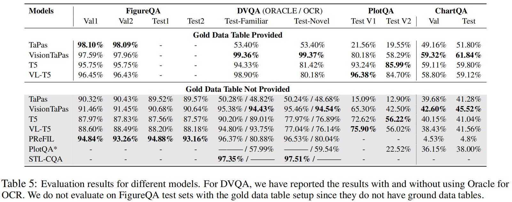

#### 5.2.2 ChartQA数据集

**结论6：**

​	VisionTaPas在两种问题设置上（提供/不提供数据表格标注）都达到了sota效果。

​	PReFIL则表现得特别差，因为它是一个分类器模型，在ChartQA这种**开放词库的问题**上效果就会特别差。

**结论7：**

​	现象：VL-T5效果没有T5好。

​	原因：可能是因为本文数据集中有很多视觉问题引用了多个图表元素，而VL-T5不能很有效地理解这种引用方式。

**结论8：**

​	总的来说不同模型的准确率在我们的数据集上相比之前的数据集来说都很低，这表明人工提出的视觉和推理问题的挑战性之大。

**结论9：**

​	本文模型的效果在不提供数据表格标注数据时效果会下降。这说明了从真实世界的各种风格的图表图片中**准确地自动抽取出表格结构**对于提高图表问答任务的准确率是很重要的。

评估了**模型和数据集的**迁移能力

①先在PlotQA数据集上预训练了两个效果最好的模型（VisionTaPas和VL-T5）

②然后在ChartQA上对其进行微调。

**结论10：**

​	现象：VL-T5的准确率从41.56%提高到了51.84%，VisionTaPas只提升了1.56%。

​	原因：可能的原因是VisionTaPas不支持ChartQA这种很常见的这种嵌套的算术操作。

**结论11：**

​	总的来说，实验结果像PlotQA这样的大型数据集在**预训练模型**方面很有用，尽管他的问题都是用一小部分模板生成的。

**结论12：**

​	实验设置：在PlotQA上训练VL-T5和VisionTaPas，然后**直接**在ChartQA上直接评估模型的效果**不做任何调整**。

​	现象：模型在PlotQA上训练而不是在其目标数据集上训练的时候，效果大幅下降（VisionTaPas从45.52%降到了31.96%）。

​	结论：本文提出的数据集ChartQA在**视觉和组合问题**上提供了更大的挑战，且词汇变化这些之前数据集所缺乏的，在本文数据集中也有体现。

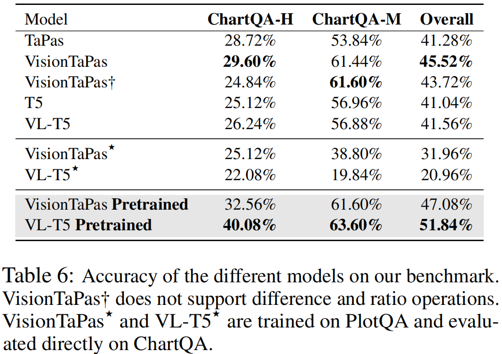

### 5.3 消融实验

**结论13：**

​	目的：评估在VisionTaPas模型上加的扩展部分的重要性，做消融实验来验证。

​	实验设置：从模型中移除了**求差值**和求斜率操作。

​	现象：见表6，总的准确率下降了1.8%左右，并且在ChartQA-H（这个数据集里有很多这类问题）上的准确率下降了4.76%。

​	结论：表明加上求差值操作和求斜率的操作是非常有用的。

**结论14：**

​	分析不同图表类型上模型效果。

​	现象：VisionTaPas和VL-T5在柱形图上表现得更好，在其它类型的图表上效果下降。

​	原因：主要是因为其他图表的数据提取错误率更高，尤其是饼图最为明显，饼图在我们数据集里样本量比较少。

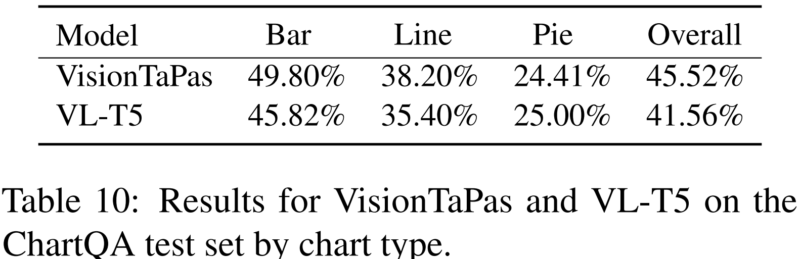

**结论15：**

​	分析不同问题类型上模型效果。

​	实验设置：随机采样了200个人提出的问题。

​	现象：数值检索类型的问题表现得更好，视觉类问题效果更差一点。

​	原因：因为数值检索类型的问题不需要数值推理，而视觉类问题用视觉特性引用了图表元素，这一点还是比较困难的。

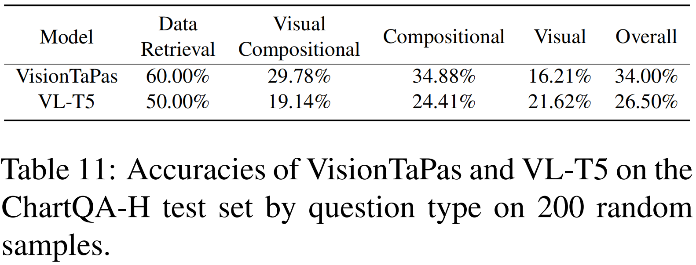

### 5.4定性分析

手动分析模型的预测效果，得出现存模型的关键瓶颈。

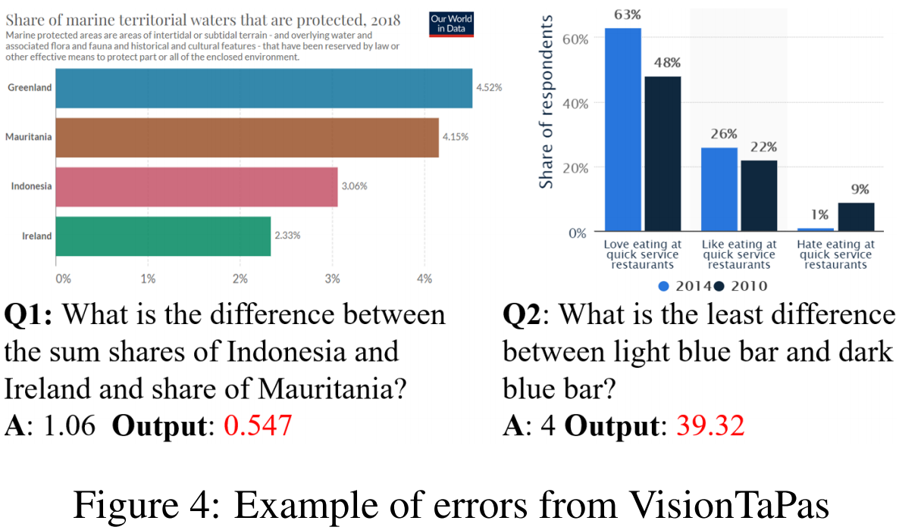

#### 5.4.1 带嵌套操作的逻辑推理

问题：VisionTaPas和VL-T5可以处理不同的数值和逻辑操作，但是他们还是不能很好处理**嵌套操作**。

**例如**图4中的Q1需要模型把两个数字加起来然后减掉另一个数，但是我们的模型只输出了两个数的差。

解决方向：后续将会扩展VisionTaPas模型（可能通过把模型用sequential fashion数据集来训练尝试解决这个问题）

#### 5.4.2 输入表示

难点：复杂的视觉符号操作可能需要多阶段的推理过程（例如图4中的Q2）。

现状&问题：目前本文模型分别输入**数据表格**和图表的**视觉特征**，然后将其结合起来。这样的的表示不能完全捕捉到图表结构。

解决方向：之后尝试使用更好的表示方法（例如语义图表示），这样的方法可以利用问题、图表对象和数据值之间的关系。

#### 5.4.3 计算机视觉挑战

问题：表5表明，本文模型在数据表格的标注数据没给出的时候效果会下降。

现状：目前的数据自动抽取模型是模块化的，融合了深度学习方法和基于规则的方法，这样会比较容易出错。

解决方向：表明了我们需要**准确率更高的表格抽取模型**，一个端到端的深度学习方法可以大大提高准确率和针对不同风格图表的泛化能力。

## 6.Conclusion

**本文工作1：**提出了一个大型benchmark数据集ChartQA，里面包含了人类针对**视觉和逻辑推理**对图表提出的问题。

**本文工作2：**提出了一个新的方法，结合了**视觉特征**和从图表中抽取出来的**表格结构**来回答问题。

**模型效果及结论：**本文的模型评价主要关注方法的先验假设，这也表明了人类提出的视觉和逻辑推理问题的几大难点，体现了自然语言的非正式性、错综复杂以及一些细小的差别。

