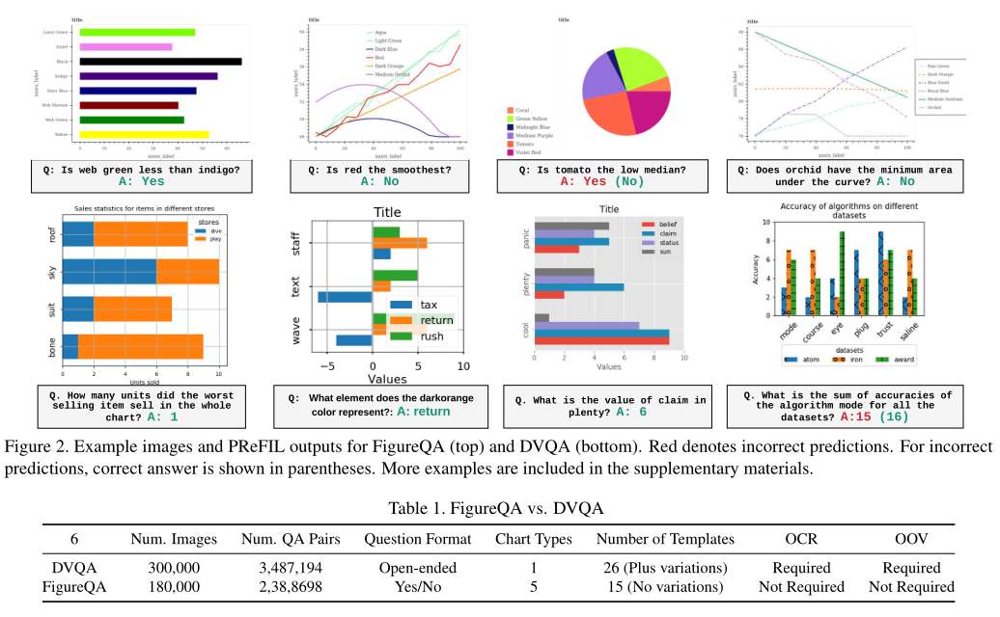
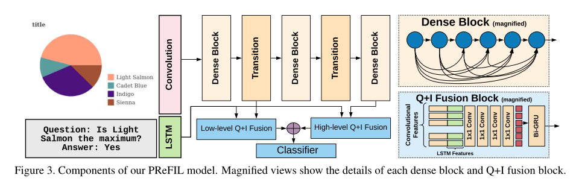
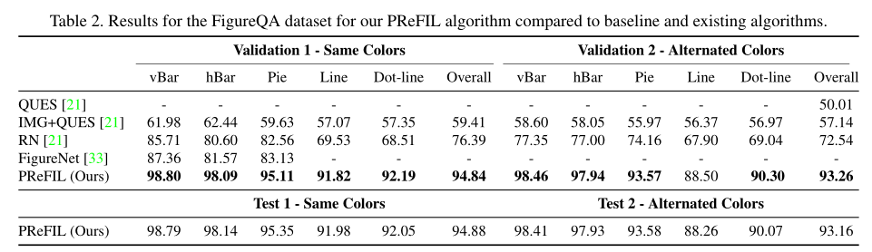
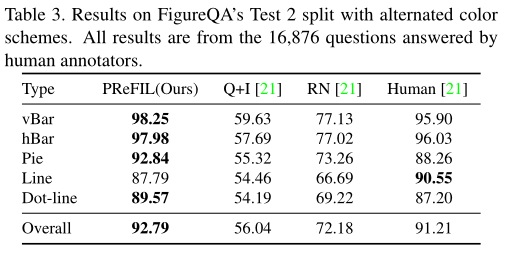
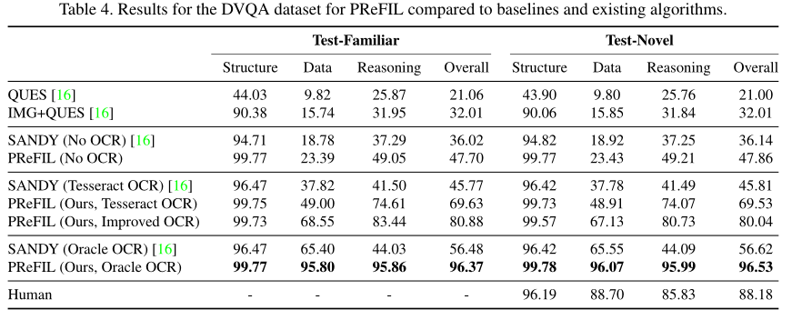
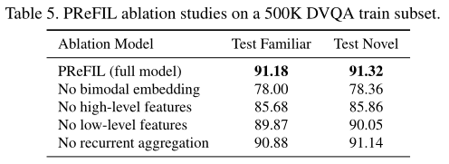
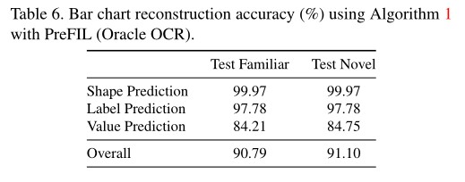

# Answering Questions about Data Visualizations using Efficient Bimodal Fusion
### Abstract：
Chart question answering (CQA) is a newly proposed visual question answering (VQA) task where an algorithm must answer questions about data visualizations, e.g. bar charts, pie charts, and line graphs. CQA requires capabilities that natural-image VQA algorithms lack: fine-grained measurements, optical character recognition, and handling out-of-vocabulary words in both questions and answers. Without modifications, state-of-the-art VQA algorithms perform poorly on this task. Here, we propose a novel CQA algorithm called parallel recurrent fusion of image and language (PReFIL). PReFIL first learns bimodal embeddings by fusing question and image features and then intelligently aggregates these learned embeddings to answer the given question. Despite its simplicity, PReFIL greatly surpasses state-of-the art systems and human baselines on both the FigureQA and DVQA datasets. Additionally, we demonstrate that PReFIL can be used to reconstruct tables by asking a series of questions about a chart.

### 1.introduction

图表QA（CQA）是一项VQA任务，涉及回答有关数据可视化的问题。从形式上讲，给定数据可视化图像I和关于I的问题Q，CQA模型必须预测答案a。CQA需要理解图像中不同“符号”（图表中的元素）之间的关系。与自然图像相比，即使对图像进行微小的修改，也会导致正确答案的剧烈变化，这使得CQA成为研究推理机制的极好平台。CQA通常需要光学字符识别（OCR）和处理给定可视化所特有的单词。

本文描述了一种新的算法，称为图像与语言并行递归融合（PReFIL）。PReFIL通过使用低级和高级图像特征共同学习双模嵌入，这使得它能够回答需要多步骤推理和比较的复杂问题，而无需使用专门的关系或注意模块。大量实验表明，在两个具有挑战性的CQA数据集中，我们的算法性能优于当前最先进的方法。

我们的主要贡献是：

• 严格审查了现有的CQA数据集，概述了它们的优缺点（第2.1节）。  
• 使用众包方式收集DVQA数据集的人的表现（第4节）  
• 提出了一种新的算法，称为并行递归早期图像与语言融合（PReFIL）（第3节）。PReFIL在CQA数据集上大大超过了现有方法，在DVQA和FigureQA上也优于人类（第4节）。PReFIL的代码和预先培训的模型将公开发布。  
• 率先使用迭代式问答从图表中重建表格（第4.4节）  
• 根据结果，概述了创建更具挑战性的数据集和算法以理解数据可视化的路线图（第5节）。

### 2.Related work
#### 2.1两个数据集DVQA和FigureQA。 

如图所示。

#### 2.1.1DVQA与FigureQA

DVQA和FigureQA各有优缺点。我们在下面对它们进行比较和对比。共同优势：两个数据集都很大，并提供足够的训练样本来训练大型模型。这两个数据集都为问答对之外的所有图形元素提供了详细的注释，这两个数据集的创建者都试图消除一些偏见的来源。最后，这两个数据集都提供了简单和困难测试拆分，其中困难测试拆分衡量的泛化程度超出了培训期间看到的范围。但DVQA的优势大于FigureQA。共同限制：作为合成生成的数据集，DVQA和FigureQA都忽略了现实世界数据可视化中的许多可变性。所有DVQA的图表都是用Matplotlib制作的，所有FigureQA的都是用Bokeh制作的。FigureQA仅使用通用标题和其他图表元素。DVQA有一些种类，但最终仅限于几个模板。虽然问题可能很复杂，但它们缺乏人工生成的查询的多样性。

#### 2.2现有CQA算法
SANDY使用了叠加注意力网络（SAN）的改进版本，该版本已广泛用于VQA。SAN使用这个问题来关注卷积特征映射。它无法处理DVQA测试集中的OOV单词或其问题和答案中的图表特定单词。为了解决这个问题，SANDY使用现成的OCR方法来识别这些单词，并引入动态编码来表示OOV和图表特定的单词。SANDY的OCR动态编码方案可以合并到任何基于分类的VQA算法中。 
FigureQA的创建者在他们的数据集上使用了关系网络（RN）。RN编码图像中每对“对象”之间的成对交互，使其能够回答涉及关系的问题。每个“对象”都是卷积特征映射的一个单元。在CLEVR中，RN被证明在组合推理方面特别有效，它超过了图QA中的基线。 
FigureNet是由不同模块组成的FigureQA的多步骤算法。第一个模块称为光谱分离器，用于识别图表的元素和颜色。然后是提取模块，该模块量化每个元素表示的值。然后将其与前馈网络一起用于预测答案。FigureNet使用FigureQA图表元素的详细注释对每个模块进行预培训。因为FigureNet依赖于访问每个图表元素的度量值，所以他们只能将其应用于FigureNet的条形图和饼图。
### 3.PReFIL模型
我们提出了用于CQA的PReFIL算法。如图3所示，PReFIL有两个平行的Q+I融合分支。每个分支都从40层DenseNet的两个位置获取问题特征（来自LSTM）和图像特征，即低级特征（来自第14层）和高级特征（来自于第40层）。每个Q+I融合块将问题特征连接到卷积特征图的每个元素，然后有一系列1×1卷积来创建问题特定的双模嵌入。这些嵌入被反复聚合，然后被送入预测答案的分类器。尽管PReFIL由相对简单的元素组成，但其性能优于使用RN和注意机制的更复杂方法。
#### 3.1多阶段图像编码器
对于所有模型，图像编码器都是经过从头开始培训的DenseNet。DenseNet是训练深度卷积神经网络（CNN）的有效架构。它由几个“dense blocks”和dense blocks之间的“transition blocks”组成。每个dense block有几个卷积层，其中每个层使用前面所有层的输出作为其输入。transition blocks位于两个密集块之间，通过卷积和池来改变特征图大小。这种体系结构鼓励功能重用，改进训练，并减轻逐渐消失的梯度，使培训非常深入的网络变得容易。功能重用允许DenseNet学习复杂的视觉功能，与其他架构相比，参数更少。

在深层CNN中，复杂特征作为视觉特征的层次结构来学习，早期层学习简单特征，后期层学习更高级的特征，这些特征是简单特征的组合。在数据可视化中，诸如色块、线条、纹理等简单特征传达的重要信息通常被CNN的深层抽象掉。因此，我们在模型中使用了低卷积和高卷积特征，这两种特征都与使用LSTM学习的问题嵌入一起被送入并行融合模块。
#### 3.2图像与语言的并行融合
使用视觉和语言特征联合调整视觉特征可以让模型为下游任务学习更丰富的特征。我们的Q+I融合块首先将所有输入卷积特征图的空间位置与问题特征连接起来，然后使用一系列使用1×1卷积的层进行双模融合。这允许问题调整视觉特征处理，并产生从图像和问题中捕获信息的双模嵌入。这种方法类似于早期的VQA模型，它将CNN嵌入连接到问题嵌入，关键的区别在于这发生在整个场景的空间池之前。我们并行地对低级和高级卷积特征执行此操作。
#### 3.3双模特征的循环聚合
在CNN中，从特征图F中聚合信息的最常用方法∈ RM×N×D是通过平均池或最大池来跨空间维度折叠以生成D维向量。另一种方法是“展平”F，将其转换为DM N维向量。最近关注的方法使用加权和进行了探索，其中每个区域的相对重要性都基于这个问题。这些方法可能无法捕获功能之间的交互，特别是对于诸如问答之类的高级任务。为了解决这个问题，我们使用双向选通递归单元（biGRU）来聚合信息，该单元依次从F中的每个MN位置获取D维特征。聚合的特征被发送到分类器以预测答案。
#### 3.4DVQA数据集的OCR集成
与FigureQA和大多数VQA任务不同，DVQA需要OCR来回答其推理和数据问题。一个由训练中看到的所有单词组成的固定词汇表是不够的，因为模型在测试过程中会遇到OOV单词。为了将OCR集成到PReFIL中，我们使用与SANDY模型相同的动态编码方案。动态编码创建一个特定于图像的字典，该字典将场景元素的空间位置与字典中的条目相关联。在运行网络之前，使用OCR检测所有单词，然后根据每个单词的空间位置将其与动态编码字典中的相应元素相关联。随后，如果遇到动态词典中的疑问词，则相应的元素设置为1。对于答案，将为动态编码输出保留一部分分类层。 
为了评估OCR的影响，我们测试了三个OCR版本以及一个未经动态编码训练的算法版本，即，仅使用从列车分割构造的固定词汇表。前两个OCR系统：一个是oracle（完美）OCR模型，另一个是使用Tesseract的真实OCR系统。

### 4.实验和结果
#### 4.1FigureQA
FigureQA有两个验证集和两个非公开可用的测试集。验证1和测试1的颜色与训练集相同，验证2和测试2的颜色方案与训练不同。

#### 4.2DVQA
DVQA分为Test Familifier（测试熟悉）和Test Novel（测试新颖），前者包含带单词的条形图，后者也包含在Train set中遇到的单词。表4给出了两个DVQA分割的结果。

#### 4.3消融实验
我们通过分析一系列消融实验来研究PReFIL组分的贡献。我们在只有500000个随机选择的训练样本的DVQA子集上对每个模型变体和原始PReFIL（Oracle OCR）进行了25轮的训练。消融模型为：

#### 4.4.通过提问重建表格
作为PReFIL的应用，我们介绍了DVQA的表重建。DVQA的问题模板通过反复询问每个图表的问题，提供了完全重构条形图所需的问题。我们的方法在算法1中给出。重建示例如图4所示，使用PReFIL（Oracle OCR）的结果如表6所示。形状预测可以以近乎完美的精度完成，但标签和值预测的性能都会下降。为了研究图表重建中不同组件的准确性，我们还报告了迭代问答的三个主要组件的准确性：1）形状预测：关于图片中条形和图例数量的问题；2） 标签预测：预测给定条或图例的标签；和3）V值预测：预测给定条的值。

### 5.讨论
所有OCR版本在结构问题上都超过了人类基线，但只有使用oracle OCR的PReFIL在所有问题类型上超过了人类。我们发现更好的OCR方法可以为DVQA带来更好的结果。OCR技术的未来发展可能会进一步改善PReFIL。
### 6.结论
提出了PReFIL这一新的CQA系统，它改进了最先进的技术，并在两个数据集上超越了人类的准确性。与其他VQA任务一样，我们的结果表明需要更难的数据集。对于CQA来说，更好的OCR对于推进该领域也很重要。我们的工作有潜力改进从图表中检索信息，图表有许多应用，包括自动信息检索、表格重建，以及帮助有视觉障碍的人更好地理解图表。
