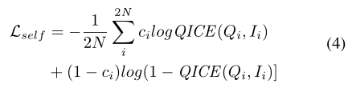
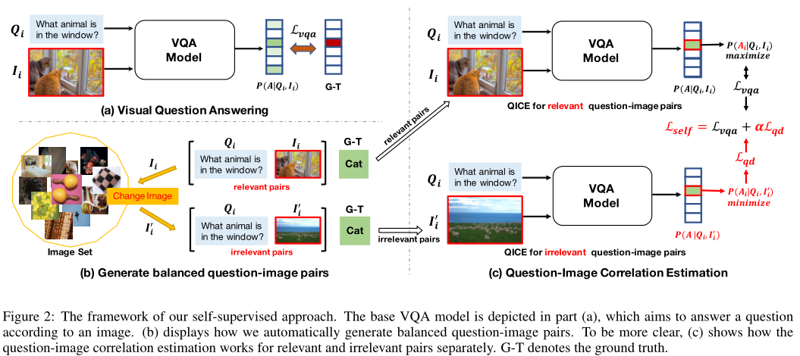
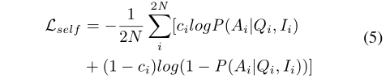
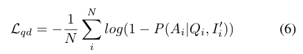
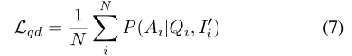
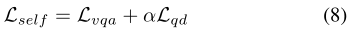

# SSL-VQA
**QICE**：可以迫使模型参考图像内容，而不是盲目回答。为此，我们提出了一个称为问题图像相关性估计（QICE）的辅助任务，即二元分类任务，用于在回答问题之前预测问题图像对是否相关。在本文中，我们定义了相关问题图像对，因为图像可以用来回答具有特定答案的问题。

**平衡问题-图像对**：通过替换（Q，I）问答对中的I，（Q，I）为相关问答对c=1，（Q，I’）为不相关问答对c=0。最终得到的数据集有一半是相关，一般是无关。

**相关性估计**：利用生成的平衡数据，我们可以训练QICE模型，通过优化交叉熵损失来预测每个问题图像对的相关标签。

Lself可以被解释为自监督训练损失，因为它仅利用我们生成的数据中的标签监督c。目标函数确保QICE模型能够理解问题和图像内容，因为每个Q对应于平衡的相关和无关实例，并且不依赖语言先验。在下一小节中，我们将讨论如何利用我们的辅助任务QICE和平衡数据，以帮助VQA模型在统一框架中消除语言偏见。

在本节中，我们提出了一个统一的VQA框架，可以在训练期间同时回答问题和估计问题图像相关性。显然，上面定义的QICE任务可以与VQA共享相同的网络结构，因为它们具有完全相同的输入和类似的输出：它们都将问题图像对（I，Q）作为输入，VQA预测答案空间a上的分布，而QICE生成特定答案a上的二进制标签。这种特性促使我们在统一的VQA框架中同时解决这两个任务，如图2所示。

对于图2（a）所示的VQA模型，它将相关问题图像对（Q，I）作为输入，并预测答案空间a上的分布F（a|Q，I），可通过最小化VQA损失Lvqa ce或Lvqa ml进行优化。该目标函数教导模型学习回答问题的能力。对于图2（c）中显示的QICE，给定对应于特定答案a的问题图像对（I，Q），VQA模型的预测概率P（a|Q，I）可被视为（I，Q）是相关对的置信度。概率越大，匹配度越高。因此，Lself可以重写为：

该模型需要对问题图像相关性估计任务进行正确的二值预测，这可以加强模型以更好地理解图像，因为每个问题都与等量的相关和不相关图像配对。更具体地说，Lself的第一项旨在最大化问题图像对相关的置信度，这与VQA任务的目标一致，该任务以高置信度预测地面真值A。

最重要的是，Lself的第二项被设计为最小化一对相关的置信度，这完全符合语言先验约简。直观地说，VQA模型的问题依赖性可以通过给定不相关图像时正确回答问题的置信度来衡量。信心越大，依赖性越强。最小化无关对的置信度可以显式地防止VQA模型被语言先验过度驱动，这里我们将其命名为问题依赖性损失Lqd：

最小化P（A | Q，I’）和最小化−log(1 − P(A|Q, I’))等价。但在训练时最小化前者比最小化后者稳定。所以将公式更新为:

因此，QICE任务自然可以被视为基础多任务学习，包含两个任务：原始VQA任务和语言先验约简任务。我们可以将Lself重新表述如下：

其中，Lvqa可以是任何VQA损失（Lvqa ce或Lvqa ml），α是超参数。显然，Lself可以被视为广义的VQA损失，因为当α=0时，它退化为Lvqa。这意味着问题依赖性损失Lqd实际上充当正则化子，防止VQA模型记忆语言先验并迫使其更好地理解图像。因此，Lself在控制回答问题和减少语言先验之间的平衡方面提供了灵活性。此外，我们不需要显式优化模型，使其成为估计问题图像对相关性的专家，我们只需要使用其平衡监督来补偿VQA中的偏见和自监督损失。在此之后，我们的方法可以在不使用外部监督的情况下以自我监督的方式减轻语言先验。