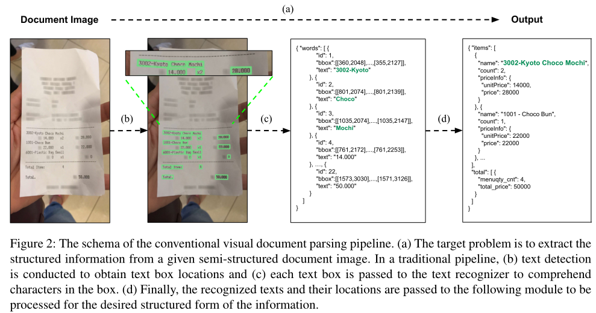
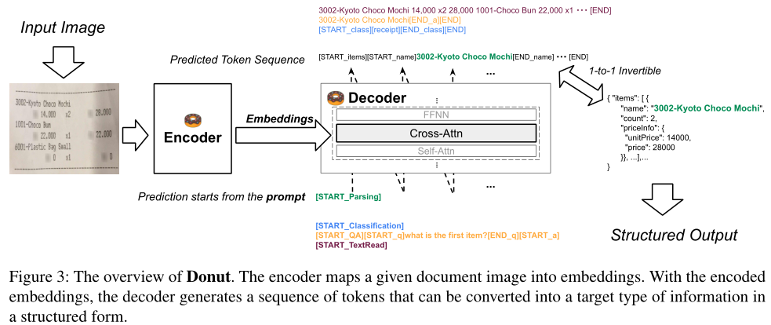
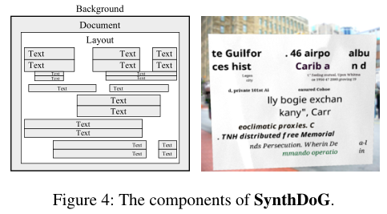
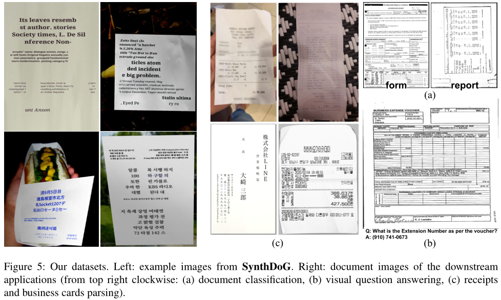
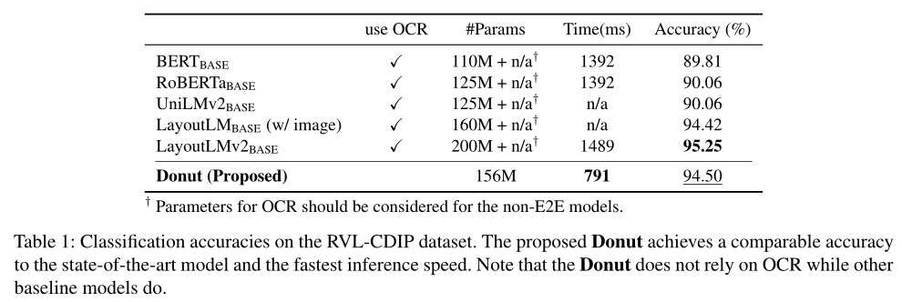
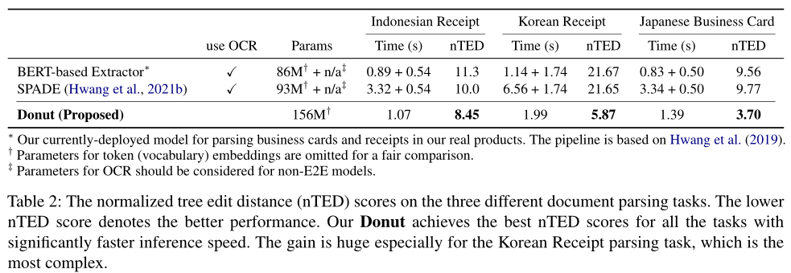
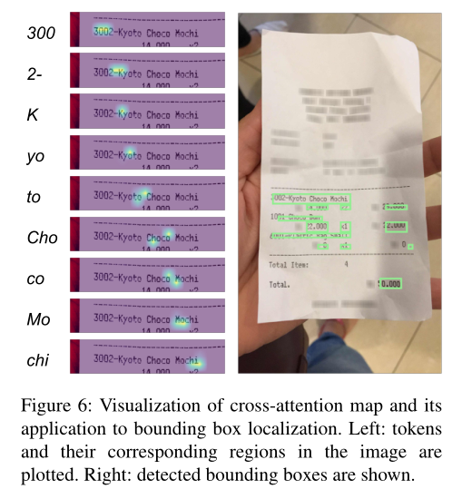
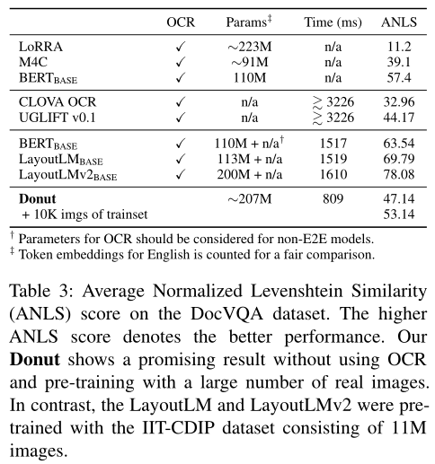

# Donut : Document Understanding Transformer without OCR

### Abstract:
Understanding document images (e.g., invoices) has been an important research topic and has many applications in document processing automation. Through the latest advances in deep learning-based Optical Character Recognition (OCR), current Visual Document Understanding (VDU) systems have come to be designed based on OCR. Although such OCR-based approach promise reasonable performance, they suffer from critical problems induced by the OCR, e.g., (1) expensive computational costs and (2) performance degradation due to the OCR error propagation. In this paper, we propose a novel VDU model that is end-to-end trainable without underpinning OCR framework. To this end, we propose a new task and a synthetic document image generator to pre-train the model to mitigate the dependencies on largescale real document images. Our approach achieves state-of-the-art performance on various document understanding tasks in public benchmark datasets and private industrial service datasets. Through extensive experiments and analysis, we demonstrate the effectiveness of the proposed model especially with consideration for a real-world application.

### 1.introduction

半结构化文档，如发票、收据和名片，通常在现代工作环境中处理。其中一些文件以数字电子文件的形式存在，而另一些则以扫描图像甚至照片的形式存在。视觉文档理解（VDU）是一项旨在理解文档图像的任务，尽管其格式、布局和内容各不相同。VDU是自动化文档处理的重要步骤。其以下各种应用包括文档分类、解析和视觉问答。

通过基于深度学习的光学字符识别（OCR）的显著进步，大多数现有的VDU系统共享类似的架构，该架构依赖于单独的OCR模块从目标文档图像中提取文本信息。系统将OCR提取的文本信息作为输入，并使用OCR提取文本执行其自身的目标。例如，一个当前部署的名片和收据图像文档解析系统，由三个单独的文本检测、文本识别和解析模块组成（见图2）。

然而，在实践中，这种方法存在几个问题。训练OCR很昂贵，商用OCR可能会出现一系列错误，OCR错误会对后续过程产生负面影响。

作者通过建模从原始输入图像到所需输出的直接映射，超越了传统框架。提出的模型甜甜圈是端到端可训练的，不依赖于任何其他模块（例如OCR），也就是说，模型是完整的。除此之外，为了减轻对大规模真实文档图像的依赖，作者还介绍了合成文档生成器SynthDoG及其在模型预训练中的应用。虽然想法很简单，但作者在各种数据集（包括真实工业基准）上的实验表明了作者的建议的有效性。这项工作的贡献总结如下：

1.提出了一种新的视觉文档理解方法。这是第一种基于以端到端方式训练的简单无OCR Transformer架构的方法。 
2.为所提出的模型提供了一个合成文档图像生成器和一个简单的预训练任务。 
3.对公共基准和私人工业服务数据集进行了广泛的实验和分析，表明所提出的方法不仅实现了最先进的性能，而且在实际应用中具有许多实际优势（例如，成本效益）。

### 2.方法
#### 2.1 背景
已有各种视觉文档理解（VDU）方法来理解和提取半结构化文档中的基本信息，如收据、发票和文档表单。

VDU中的早期尝试采用了基于视觉的方法，表明了文本理解在VDU中重要性。随着BERT的出现，大多数最先进的技术将计算机视觉（CV）和自然语言处理（NLP）技术结合在一起，近年来取得了显著的进步。

最新的方法共享一种通用方法，即使用大规模真实文档图像数据集，并依赖于一个单独的OCR引擎，其中模型在大量真实文档图像上进行预训练。在测试阶段，OCR引擎对看不见的图像执行操作以提取文本信息，然后将文本信息提供给后面的模块以实现其自身目标。因此，需要额外的努力，通过使用重型OCR引擎来确保整个VDU模型的性能。

#### 2.2 文档理解Transformer

作者提出了一个简单的基于转换器的编码器-解码器模型，称为文档理解转换器（Donut），它是一种端到端的模型，不依赖于任何其他模块，如OCR。作者旨在设计基于转换器的简单架构。Dount由视觉编码器和文本解码器模块组成。该模型将输入文档图像直接映射为一对一转换为所需结构化格式的令牌序列。提出模型的概述如图3所示。

**编码器。** 视觉编码器转换输入文档图像x∈RH×W×C到嵌入集{zi|zi∈Rd，1≤i≤n} 其中n是特征图大小或图像块的数量，d是编码器的潜在向量的维数。基于CNN的模型或基于Transformer的模型可以用作编码器网络。在本研究中，如果没有另外提及，作者使用Swin Transformer，因为它在作者的文档解析初步研究中显示了最佳性能。Swin Transformer首先将输入图像x分割为非重叠面片。然后，以下Swin Transformer块，其中内部具有移动窗口的局部自注意力机制，区域合并层应用于区域token。解码器中使用最终Swin Transforemr块{z}的输出。

**解码器。** 给定表示{z}，文本解码器生成令牌序列（yi）m1，其中yi∈Rv是令牌i的一个独热向量，v是令牌词汇表的大小，m分别是超参数。作者使用BART作为解码器架构；具体而言，作者使用多语言BART模型。为了满足各种实际应用程序的适用速度和内存要求，作者使用了BART的前4层。

**模型输入。** 模型训练是以教师强迫的方式进行的。在测试阶段，受GPT-3的启发，模型在给出提示的情况下生成令牌序列。在作者的实验中，作者简单地为每个下游任务的提示引入了一些新的特殊标记。作者在应用程序中使用的提示与所需的输出序列一起显示在图3中。

**输出转换。** 输出令牌序列被转换为期望的结构化格式。作者采用JSON格式，因为它具有很高的表示能力。如图3所示，令牌序列与JSON数据是一对一可逆的。作者只需添加两个特殊标记[START]_∗] 及[END]_∗] 按字段∗。如果输出令牌序列的结构错误（例如，只有[START_name]存在，但没有[END_name]），作者只是将字段“name”视为丢失。该算法可以很容易地用一些正则表达式实现。

#### 2.3 预训练
VDU的当前技术水平严重依赖大规模真实文档图像来训练模型。然而，这种方法在现实生产环境中并不总是可用的，特别是在处理英语以外的多种语言时。

**合成文档生成器。** 为了消除对大规模真实文档图像的依赖，作者提出了一种可伸缩的合成文档生成器，称为SynthDoG。渲染图像的流程基本上遵循Yim等人。如图4所示，生成的图像由几个组件组成；背景、文档、文本和布局。背景图像从ImageNet中采样，文档纹理从收集的照片中采样。单词和短语取自维基百科。应用基于规则的随机模式来模拟真实文档中的复杂布局。此外，图像渲染中的一些主要技术被应用于模拟真实照片。SynthDoG生成的示例图像如图5所示。

**任务。** 作者使用SynthDoG生成了120万张合成文档图像。作者使用了从英语、韩语和日语维基百科中提取的语料库，并为每种语言生成了400K图像。任务很简单。模型被训练为按照从左上到右下的读取顺序读取图像中的所有文本。示例如图3所示。

#### 2.4 应用
在模型学习如何阅读之后，在应用程序阶段（即微调），作者教模型如何理解给定的文档图像。如图3所示，作者将所有下游任务解释为JSON预测问题。

解码器被训练以生成表示所需输出信息的JSON。例如，在文档分类任务中，解码器被训练以生成令牌序列[START_class][memo][END_class]，该令牌序列1到1可逆为JSON｛“class”：“memo”｝。作者引入了一些特殊的标记（例如，[memo]用于表示类“memo”），如果这种替换在目标下游任务中可用。

### 3.实验与分析
#### 3.1 下游任务与数据集
作者在下面的数据集上提供了作者运行实验的下游任务。数据集示例如图5所示。

#### 3.1.1 文档分类
为了查看模型是否理解文档类型，作者测试了文档分类任务。使用RVL-CDIP数据集。与其他通过编码token嵌入上的softmax预测类标签的模型不同，作者使解码器生成包含类标签信息的JSON，以保持任务解决方法的一致性。作者报告了测试集的总体分类精度。

#### 3.1.2 文档解析
为了使模型完全理解给定文档图像中的复杂布局、格式和内容，作者进行文档解析，这是从输入文档图像中提取所需结构化信息的任务（见图2）。使用Indonesian Receipts数据集、Japanese Business Cards数据集和Korean Receipts数据集。

#### 3.1.3 Document VQA
为了验证模型的进一步能力，作者进行了文档视觉问答任务（DocVQA）。在这个任务中，给出了一个文档图像和一个自然语言问题，该模型通过理解图像中的视觉和文本信息来预测问题的正确答案。作者让解码器生成包含问题（给定）和答案（预测）的JSON，以保持方法的一致性。使用DocVQA数据集。

### 3.2 设置 略

### 3.3 结果
#### 3.3.1 文档分类
分类精度如表1所示。在不依赖OCR或大规模真实文档图像的情况下，提出的甜甜圈显示出与现有技术相当的性能。与其他基于transformer的模型不同，作者的模型的token嵌入可以在此任务中删除，因为推理是以端到端的方式进行的。

#### 3.3.2 文档解析
归一化树编辑距离（NTD）得分如表2所示。作者将提出的模型与多年来实际产品中的基线进行了比较。对于所有领域，包括公共和私人服务内数据集，作者提出的模型显示了对比模型中最佳的NTD分数。此外，推理时间显著减少，特别是对于具有高复杂度的领域，即韩语收据解析任务。这证明了作者的建议在实际应用中的有效性。

作为一个真实的产品，客户有时需要对提取的价值进行本地化。作者在图6中显示了给定一个看不见的印度尼西亚收据的解码器的交叉注意力图。它显示了模型关注给定图像中所需位置的有趣结果。使用简单的启发式方法，作者将注意力图转换为一个边界框，样本如图所示。尽管该模型不如商业OCR产品准确，但该模型显示了有意义的结果，可以用作辅助指标。

#### 3.3.3 Document VQA
结果如表3所示。作者的方法在不依赖OCR和大规模真实文档图像（如IIT-CDIP）的情况下显示了一个有希望的结果。第三组的结果是最好的，因为他们均使用大规模扫描的英语文档数据集进行预训练。他们的分数与作者的分数之间的差距意味着预训练对大规模真实文档的影响，这将是作者未来要解决的问题之一。与比较方法相比，甜甜圈显示出合理的性能和更快的推理速度。

与其他方法相比，甜甜圈显示出合理的性能和更快的推理速度。为了展示甜甜圈的潜在能力，作者还通过使用DocVQA训练集的10K真实图像进行额外的预训练，展示了甜甜圈性能。虽然额外的预训练图像有噪声，并且图像数量很少（10K），但它会显著提高性能（47.14→ 53.14），这证明了真实文档图像的重要性。

### 4.相关工作 略
### 5.结论
在这项工作中，作者提出了一种新的用于视觉文档理解的端到端方法。提出的方法Donut将输入文档图像直接映射到所需的结构化输出。与传统方法不同，作者的方法不依赖于OCR和大规模真实文档图像。作者还提出了一个合成文档图像生成器SynthDoG，它以课程学习的方式在模型的预训练中起着重要作用。作者通过提出的训练管道，逐步训练模型，从如何阅读到如何理解。作者在外部公共基准和私有内部服务数据集上的广泛实验和分析表明，该方法具有更高的性能和更好的成本效益。这是一个重大影响，因为目标任务已经在工业中实际使用。作者未来的工作是将提出的方法扩展到与文档理解相关的其他领域/任务。

